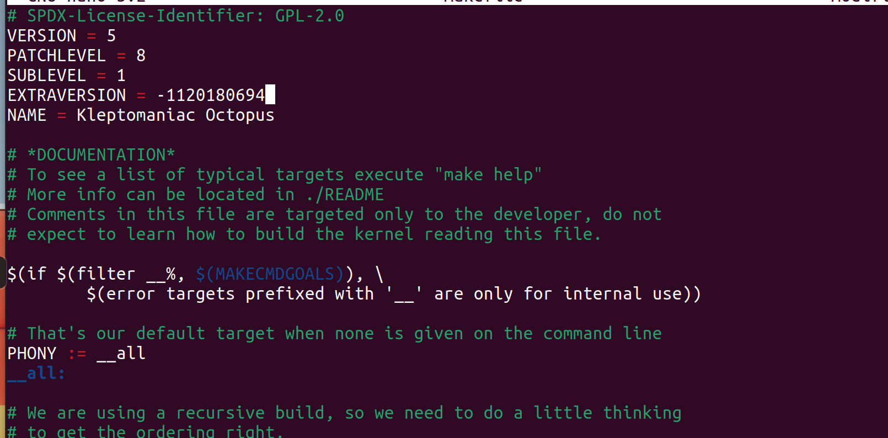

# Linux 内核编译

本次实验中使用了Ubuntu 20.10发行版 ，codename : groovy gorilla

现在vmware中进行ubuntu的

安装完之后先到 /etc/apt/sources.list 将软件源换位阿里云的源，以提高下载速度

之后在阿里云镜像站下载linux内核，本次实验中下载的版本为linux 5.8.1

之后在Downloads文件夹将其解压缩，

~~~~~~~~~~~~~~~~~~~~~~~~~~~~~~~~~~~~~~~~~~~~~~~~~~~~~~~~~~~~~~~~~~~~~~~~~~~~~~~~
sudo tar -xvf linux-5.8.1.tar.gz -C /usr/src
~~~~~~~~~~~~~~~~~~~~~~~~~~~~~~~~~~~~~~~~~~~~~~~~~~~~~~~~~~~~~~~~~~~~~~~~~~~~~~~~

解压完成后如图：

之后为了方便后续操作，为所需要的linux-5.8.1 文件夹建立名为myKernel快捷方式链接

~~~~~~~~~~~~~~~~~~~~~~~~~~~~~~~~~~~~~~~~~~~~~~~~~~~~~~~~~~~~~~~~~~~~~~~~~~~~~~~~
sudo ln -s /usr/src/linux-5.8.1 myKernel
~~~~~~~~~~~~~~~~~~~~~~~~~~~~~~~~~~~~~~~~~~~~~~~~~~~~~~~~~~~~~~~~~~~~~~~~~~~~~~~~

下载可能用到的包：

~~~~~~~~~~~~~~~~~~~~~~~~~~~~~~~~~~~~~~~~~~~~~~~~~~~~~~~~~~~~~~~~~~~~~~~~~~~~~~~~
sudo apt-get update
sudo apt-get upgrade
sudo apt-get install libncurses5-dev
sudo apt-get install build-essential git fakeroot
sudo apt-get install libssl-dev
sudo apt-get install bc flex bison
~~~~~~~~~~~~~~~~~~~~~~~~~~~~~~~~~~~~~~~~~~~~~~~~~~~~~~~~~~~~~~~~~~~~~~~~~~~~~~~~

下载完成之后开始准备编译内核

uname -r 查看当前内核

为5.8.0-25 generic

之后开始进行内核配置：

~~~~~~~~~~~~~~~~~~~~~~~~~~~~~~~~~~~~~~~~~~~~~~~~~~~~~~~~~~~~~~~~~~~~~~~~~~~~~~~~
sudo make menuconfig
~~~~~~~~~~~~~~~~~~~~~~~~~~~~~~~~~~~~~~~~~~~~~~~~~~~~~~~~~~~~~~~~~~~~~~~~~~~~~~~~

之后为了简便配置，从boot文件夹将现有内核的config文件覆盖到当前文件夹中的.config文件

~~~~~~~~~~~~~~~~~~~~~~~~~~~~~~~~~~~~~~~~~~~~~~~~~~~~~~~~~~~~~~~~~~~~~~~~~~~~~~~~
sudo cp /boot/config- 5.8.0-25-generic /usr/src/myKernel
sudo mv config- 5.8.0-25-generic .config
~~~~~~~~~~~~~~~~~~~~~~~~~~~~~~~~~~~~~~~~~~~~~~~~~~~~~~~~~~~~~~~~~~~~~~~~~~~~~~~~

之后修改makefile中的EXTRAVERSION字段，加入自己的学号。

修改makefile文件之后，开始编译过程，使用make -j5命令。

Note: -j\* 表示并发执行，创建虚拟机的时候选择了一共给了四个内核，则
并发时选择了比CPU数多一个，即 -j5

~~~~~~~~~~~~~~~~~~~~~~~~~~~~~~~~~~~~~~~~~~~~~~~~~~~~~~~~~~~~~~~~~~~~~~~~~~~~~~~~
sudo make -j5
~~~~~~~~~~~~~~~~~~~~~~~~~~~~~~~~~~~~~~~~~~~~~~~~~~~~~~~~~~~~~~~~~~~~~~~~~~~~~~~~

在第一次经过两个半小时左右的编译后，最后出现错误：

~~~~~~~~~~~~~~~~~~~~~~~~~~~~~~~~~~~~~~~~~~~~~~~~~~~~~~~~~~~~~~~~~~~~~~~~~~~~~~~~
BTF: .tmp_vmlinux.btf: pahole (pahole) is not available
Failed to generate BTF for vmlinux
Try to disable CONFIG_DEBUG_INFO_BTF
make: *** [Makefile:1106: vmlinux] Error 1
sudo apt-get install dwarves
~~~~~~~~~~~~~~~~~~~~~~~~~~~~~~~~~~~~~~~~~~~~~~~~~~~~~~~~~~~~~~~~~~~~~~~~~~~~~~~~

重新执行编译过程

十分钟编译过后，成功完成

之后安装模块：

~~~~~~~~~~~~~~~~~~~~~~~~~~~~~~~~~~~~~~~~~~~~~~~~~~~~~~~~~~~~~~~~~~~~~~~~~~~~~~~~
sudo make modules_install
~~~~~~~~~~~~~~~~~~~~~~~~~~~~~~~~~~~~~~~~~~~~~~~~~~~~~~~~~~~~~~~~~~~~~~~~~~~~~~~~

模块安装完成，开始安装过程：

~~~~~~~~~~~~~~~~~~~~~~~~~~~~~~~~~~~~~~~~~~~~~~~~~~~~~~~~~~~~~~~~~~~~~~~~~~~~~~~~
sudo make install
~~~~~~~~~~~~~~~~~~~~~~~~~~~~~~~~~~~~~~~~~~~~~~~~~~~~~~~~~~~~~~~~~~~~~~~~~~~~~~~~

安装完成之后启动内核作为引导：

~~~~~~~~~~~~~~~~~~~~~~~~~~~~~~~~~~~~~~~~~~~~~~~~~~~~~~~~~~~~~~~~~~~~~~~~~~~~~~~~
sudo update-initramfs -c -k 5.8.1-1120180694
~~~~~~~~~~~~~~~~~~~~~~~~~~~~~~~~~~~~~~~~~~~~~~~~~~~~~~~~~~~~~~~~~~~~~~~~~~~~~~~~

之后更新grub文件

~~~~~~~~~~~~~~~~~~~~~~~~~~~~~~~~~~~~~~~~~~~~~~~~~~~~~~~~~~~~~~~~~~~~~~~~~~~~~~~~
sudo update-grub
~~~~~~~~~~~~~~~~~~~~~~~~~~~~~~~~~~~~~~~~~~~~~~~~~~~~~~~~~~~~~~~~~~~~~~~~~~~~~~~~

重启后可以看到内核版本已经变更

### 出现的问题

#### 内核版本与当前相差较多

在第一次编译内核实验时，随便选择了5.1.6版本的内核，在make步骤时，只过了十几分钟就没有明显错误的结束了，之后的模块安装步骤也无法进行下去。

之后切换成了与现在内核版本接近的5.8.1版本，即可顺利按照步骤进行。

#### 未启用新安装的内核作为引导

在第二次进行实验时，完成安装步骤之后，忘记启用内核作为引导。重启之后在选择新内核启动时无法完成启动。

出现问题：

~~~~~~~~~~~~~~~~~~~~~~~~~~~~~~~~~~~~~~~~~~~~~~~~~~~~~~~~~~~~~~~~~~~~~~~~~~~~~~~~
Kernel panic - not syncing - Attempted to kill init!
~~~~~~~~~~~~~~~~~~~~~~~~~~~~~~~~~~~~~~~~~~~~~~~~~~~~~~~~~~~~~~~~~~~~~~~~~~~~~~~~

但是选用当前内核重启之后更新grub文件之后仍未能解决问题。
