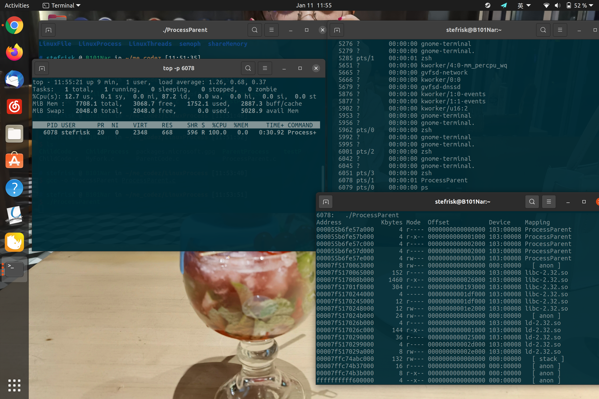

Windows内存监视器

### 系统调用以及数据结构

**GetSystemInfo**

该系统调用传入一个**SYSTEM_INFO**结构的参数并将系统的相关信息存入该结构中。

SYSTEM_INFO结构如下：

~~~~~~~~~~~~~~~~~~~~~~~~~~~~~~~~~~~~~~~~~~~~~~~~~~~~~~~~~~~~~~~~~~~~~~~~~~~~~~~~c
  _SYSTEM_INFO { 
   { 
    DWORD dwOemId; 
     { 
      WORD wProcessorArchitecture; 
      WORD wReserved; 
    } DUMMYSTRUCTNAME; 
  } DUMMYUNIONNAME; 
  DWORD     dwPageSize; 
  LPVOID    lpMinimumApplicationAddress; 
  LPVOID    lpMaximumApplicationAddress; 
  DWORD_PTR dwActiveProcessorMask; 
  DWORD     dwNumberOfProcessors; 
  DWORD     dwProcessorType; 
  DWORD     dwAllocationGranularity; 
  WORD      wProcessorLevel; 
  WORD      wProcessorRevision; 
} SYSTEM_INFO, *LPSYSTEM_INFO;
~~~~~~~~~~~~~~~~~~~~~~~~~~~~~~~~~~~~~~~~~~~~~~~~~~~~~~~~~~~~~~~~~~~~~~~~~~~~~~~~

本次实验中用到了dwPageSIze,lpMIniumApplicationAddress以及lpMaxiumApplicationAddress，来获取页面大小以及系统地址空间信息

实验中调用代码如下：

~~~~~~~~~~~~~~~~~~~~~~~~~~~~~~~~~~~~~~~~~~~~~~~~~~~~~~~~~~~~~~~~~~~~~~~~~~~~~~~~c
void showSystemInfo(void)       
{ 
    SYSTEM_INFO siSysInfo; 
 
    GetSystemInfo(&siSysInfo);    
    printf("--------------------System information--------------------\n"); 
    
    printf("Page size: %uKB\n", siSysInfo.dwPageSize / DIV);  
    printf("Minimum application address: 0x%lx\n", 
        siSysInfo.lpMinimumApplicationAddress); 
    printf("Maximum application address: 0x%lx\n", 
        siSysInfo.lpMaximumApplicationAddress); 
    printf("----------------------------------------------------------\n"); 
}
~~~~~~~~~~~~~~~~~~~~~~~~~~~~~~~~~~~~~~~~~~~~~~~~~~~~~~~~~~~~~~~~~~~~~~~~~~~~~~~~

**GlobalMemoryStatusEx**

该调用将系统的存储器使用情况信息存入传入其中的MEMORYSTATUSEX结构中。

MEMORYSTATUSEX结构如下：

~~~~~~~~~~~~~~~~~~~~~~~~~~~~~~~~~~~~~~~~~~~~~~~~~~~~~~~~~~~~~~~~~~~~~~~~~~~~~~~~c
  _MEMORYSTATUSEX { 
  DWORD     dwLength; 
  DWORD     dwMemoryLoad; 
  DWORDLONG ullTotalPhys; 
  DWORDLONG ullAvailPhys; 
  DWORDLONG ullTotalPageFile; 
  DWORDLONG ullAvailPageFile; 
  DWORDLONG ullTotalVirtual; 
  DWORDLONG ullAvailVirtual; 
  DWORDLONG ullAvailExtendedVirtual; 
} MEMORYSTATUSEX, *LPMEMORYSTATUSEX;
~~~~~~~~~~~~~~~~~~~~~~~~~~~~~~~~~~~~~~~~~~~~~~~~~~~~~~~~~~~~~~~~~~~~~~~~~~~~~~~~

实验中代码如下：

~~~~~~~~~~~~~~~~~~~~~~~~~~~~~~~~~~~~~~~~~~~~~~~~~~~~~~~~~~~~~~~~~~~~~~~~~~~~~~~~c
void _tglobalMemoryStatus(void)         
{ 
    MEMORYSTATUSEX statex; 
 
    statex.dwLength = (statex); 
 
    GlobalMemoryStatusEx(&statex); 
 
    printf("----------------Memory usage information------------------\n"); 
 
    printf("There is  %*ld percent of memory in use.\n",        
        statex.dwMemoryLoad); 
    printf("There are %.2f/%.2f free  GB of physical memory.\n", double(statex.ullAvailPhys) / (DIV * kb2gb), 
        double(statex.ullTotalPhys) / (DIV * kb2gb));   
    printf("There are %.2f/%.2f free  GB of page file.\n", double(statex.ullAvailPageFile) / (DIV * kb2gb), 
        double(statex.ullTotalPageFile) / (DIV * kb2gb));  
    printf("There are %.2f/%.2f free  GB of virtual memory.\n", double(statex.ullAvailVirtual) / (DIV * kb2gb), 
        double(statex.ullTotalVirtual) / (DIV * kb2gb));   
 
    printf("----------------------------------------------------------\n"); 
}
~~~~~~~~~~~~~~~~~~~~~~~~~~~~~~~~~~~~~~~~~~~~~~~~~~~~~~~~~~~~~~~~~~~~~~~~~~~~~~~~

**GetPerformanceInfo**

将系统性能信息存入传入的**PERFORMANCE_INFORMATION**结构中，

**PERFORMANCE_INFORMATION**结构如下：

~~~~~~~~~~~~~~~~~~~~~~~~~~~~~~~~~~~~~~~~~~~~~~~~~~~~~~~~~~~~~~~~~~~~~~~~~~~~~~~~c
  _PERFORMANCE_INFORMATION { 
  DWORD  cb; 
  SIZE_T CommitTotal; 
  SIZE_T CommitLimit; 
  SIZE_T CommitPeak; 
  SIZE_T PhysicalTotal; 
  SIZE_T PhysicalAvailable; 
  SIZE_T SystemCache; 
  SIZE_T KernelTotal; 
  SIZE_T KernelPaged; 
  SIZE_T KernelNonpaged; 
  SIZE_T PageSize; 
  DWORD  HandleCount; 
  DWORD  ProcessCount; 
  DWORD  ThreadCount; 
} PERFORMANCE_INFORMATION, *PPERFORMANCE_INFORMATION, PERFORMACE_INFORMATION, *PPERFORMACE_INFORMATION;
~~~~~~~~~~~~~~~~~~~~~~~~~~~~~~~~~~~~~~~~~~~~~~~~~~~~~~~~~~~~~~~~~~~~~~~~~~~~~~~~

可以看到，该结构中部分成员与**MEMORYSTATUSEX**结构中的成员略有重合。

实验中代码如下：(使用方法已经清晰的写在了代码注释中)

~~~~~~~~~~~~~~~~~~~~~~~~~~~~~~~~~~~~~~~~~~~~~~~~~~~~~~~~~~~~~~~~~~~~~~~~~~~~~~~~c
void performanceInformation(void)   
{ 
    
    PERFORMANCE_INFORMATION pi; 
    pi.cb = (pi); 
    GetPerformanceInfo(&pi, (pi)); 
    int pagesize = pi.PageSize; 
    printf("----------------Performance information-------------------\n"); 
    printf("Total commit page and commit limit: %ld/%ld.\n", pi.CommitTotal, pi.CommitLimit);   
    printf("Page commit peak: %ld.\n", pi.CommitPeak); 
    printf("Physical memory allocated by page: %ld/%ld.\n", pi.PhysicalAvailable, pi.PhysicalTotal); 
    printf("System cache: %.2f GB.\n", double(pi.SystemCache) * 4 / kb2gb);     
    printf("Open handles: %ld.\n", pi.HandleCount);             
    printf("Process amount: %ld.\n", pi.ProcessCount);          
    printf("Thread amount: %ld.\n", pi.ThreadCount);            
    printf("----------------------------------------------------------\n"); 
}
~~~~~~~~~~~~~~~~~~~~~~~~~~~~~~~~~~~~~~~~~~~~~~~~~~~~~~~~~~~~~~~~~~~~~~~~~~~~~~~~

**CreateToolhelp32Snapshot**

**Process32First**

**Process32Next**

**CloseHandle**

使用以上四个系统调用来遍历获得当前时刻系统中所有的进程以及相关信息。流程如下：

(1).使用**CreateToolhelp32Snapshot**以及传参**TH32CS_SNAPPROCESS**创建系统进程快照

(2).使用**Process32First**获取第一个进程的信息存入到**PROCESSENTRY32**结构体中  
(3).再用**Process32Next**遍历所有进程  
(4).最后用**CloseHandle**关闭句柄

PROCESSENTRY32结构如下：

~~~~~~~~~~~~~~~~~~~~~~~~~~~~~~~~~~~~~~~~~~~~~~~~~~~~~~~~~~~~~~~~~~~~~~~~~~~~~~~~c
  tagPROCESSENTRY32 { 
  DWORD     dwSize; 
  DWORD     cntUsage; 
  DWORD     th32ProcessID; 
  ULONG_PTR th32DefaultHeapID; 
  DWORD     th32ModuleID; 
  DWORD     cntThreads; 
  DWORD     th32ParentProcessID; 
  LONG      pcPriClassBase; 
  DWORD     dwFlags; 
  CHAR      szExeFile[MAX_PATH]; 
} PROCESSENTRY32;
~~~~~~~~~~~~~~~~~~~~~~~~~~~~~~~~~~~~~~~~~~~~~~~~~~~~~~~~~~~~~~~~~~~~~~~~~~~~~~~~

**GetProcessMemoryInfo**

**PROCESSMEMORYCOUNTERS**

对于获取到的单个进程，使用**GetProcessMemoryInfo**系统调用，将进程信息存放在**PROCESSMEMORYCOUNTERS**结构中，从而获取进程的工作集信息，对应于该结构中的**WorkingSetSize**成员。

实验中对进程进行遍历的代码如下：

~~~~~~~~~~~~~~~~~~~~~~~~~~~~~~~~~~~~~~~~~~~~~~~~~~~~~~~~~~~~~~~~~~~~~~~~~~~~~~~~c
getProcess = Process32First(hSnapshot, &pe32); 
 (getProcess) 
        { 
            hProcess = OpenProcess(PROCESS_QUERY_INFORMATION |      
                PROCESS_VM_READ, 
                FALSE, (DWORD)pe32.th32ProcessID); 
            GetProcessMemoryInfo(hProcess, &pmc, (pmc));  
             (hProcess == NULL) 
                pmc.WorkingSetSize = 0; 
            printf("%-36ls\t\t%6d\t\t  %3d\t%10dMB\n", pe32.szExeFile, pe32.th32ProcessID, pe32.cntThreads, pmc.WorkingSetSize / kb2gb);    
            getProcess = Process32Next(hSnapshot, &pe32);       
        }
~~~~~~~~~~~~~~~~~~~~~~~~~~~~~~~~~~~~~~~~~~~~~~~~~~~~~~~~~~~~~~~~~~~~~~~~~~~~~~~~

**VirtualQueryEx**

~~~~~~~~~~~~~~~~~~~~~~~~~~~~~~~~~~~~~~~~~~~~~~~~~~~~~~~~~~~~~~~~~~~~~~~~~~~~~~~~c
SIZE_T VirtualQueryEx( 
  HANDLE                    hProcess, 
  LPCVOID                   lpAddress, 
  PMEMORY_BASIC_INFORMATION lpBuffer, 
  SIZE_T                    dwLength 
);
~~~~~~~~~~~~~~~~~~~~~~~~~~~~~~~~~~~~~~~~~~~~~~~~~~~~~~~~~~~~~~~~~~~~~~~~~~~~~~~~

**MEMORYBASICINFORMATION**

对于给定的pid所打开的进程，使用VirtualQueryEx检索有关指定进程的虚拟地址空间内的一个范围的页面信息。

**VirtualQueryEx**函数确定在传入起始地址中的第一页的属性，然后扫描后续页，直到它扫描的页面的整个范围内，或直到遇到页面与非匹配属性集。该函数以字节为单位返回属性和具有匹配属性的页面区域的大小。例如，如果有40
MB的可用内存区域，并且在 **距**该区域10
MB的页面上调用**VirtualQueryEx**，则该函数将获得**MEM_FREE**状态，大小为30 MB。

对页面连续的要求如下：

-   所有页面的状态都相同（**MEM_COMMIT**，**MEM_RESERVE**，**MEM_FREE**，**MEM_PRIVATE**，**MEM_MAPPED**或**MEM_IMAGE**）。

-   如果初始页面不是空闲的，则该区域中的所有页面都是通过一次调用VirtualAlloc，MapViewOfFile创建的页面的初始分配的一部分：

-   授予所有的页面访问是相同的（**PAGE_READONLY**，**PAGE_READWRITE**，**PAGE_NOACCESS**，**PAGE_WRITECOPY**，**PAGE_EXECUTE**，**PAGEEXECUTEREAD**，**PAGEEXECUTEREADWRITE**，**PAGEEXECUTEWRITECOPY**，**PAGE_GUARD**，或**PAGE_NOCACHE**）。

实验中相关代码如下：

~~~~~~~~~~~~~~~~~~~~~~~~~~~~~~~~~~~~~~~~~~~~~~~~~~~~~~~~~~~~~~~~~~~~~~~~~~~~~~~~c
  () 
    { 
         (VirtualQueryEx(hProcess, pBegin, &mpi, (mpi)) != (mpi)) 
        { 
            ; 
        } 
        pEnd = (PBYTE)pBegin + mpi.RegionSize;      
        
        blockStat = getBlockState(mpi); 
        blockType = getBlockType(mpi); 
        blockProt = getBlockProtection(mpi); 
        
        blockSize = mpi.RegionSize * DIV / kb2gb; 
        printf("0x%08lx-0x%08lx\t%8dKB\t%10s\t%10s\t%10s\n", (unsigned int)pBegin, (unsigned int)pEnd, blockSize, blockStat, blockProt, blockType); 
        pBegin = pEnd; 
         ((unsigned int)pBegin >= (unsigned int)siSysInfo.lpMaximumApplicationAddress)    
            ; 
    }
~~~~~~~~~~~~~~~~~~~~~~~~~~~~~~~~~~~~~~~~~~~~~~~~~~~~~~~~~~~~~~~~~~~~~~~~~~~~~~~~

本次实验中，除了对多个系统调用的合理使用之外，还对输出排版进行了调整，做到格式整齐易读，而且设计了用户交互界面，提供给用户良好的使用体验。

程序运行如下：

运行后，先打印系统信息，存储器使用信息以及性能信息，之后弹出菜单界面，输入1，可显示所有进程信息如下：

注：系统进程是无法获取工作集大小的

输入2，并给出相应pid，以6816为例。

用户使用完后输入3退出。

Linux内存监视

top命令是Linux下常用的性能分析工具，能够实时显示系统中各个进程的资源占用状况，类似于Windows的任务管理器。

在系统中使用top:

第一行显示了 系统当前时间，系统开机到现在经过的时间 ， 在线用户数以及CPU负载信息

第二行显示了任务（进程）总量，运行的进程数以及睡眠的进程数。

第三行为CPU总体信息，为不同情况下占用CPU时间的百分比

第四行与第五行分别为内存信息以及交换空间信息

下面则显示了每个进程的详细信息：

~~~~~~~~~~~~~~~~~~~~~~~~~~~~~~~~~~~~~~~~~~~~~~~~~~~~~~~~~~~~~~~~~~~~~~~~~~~~~~~~
PID：进程的ID 
USER：进程所有者 
PR：进程的优先级别，越小越优先被执行 
NI：nice值 
VIRT：进程占用的虚拟内存 
RES：进程占用的物理内存 
SHR：进程使用的共享内存 
S：进程的状态。S表示休眠，R表示正在运行，Z表示僵死状态，N表示该进程优先值为负数 
%CPU：进程占用CPU的使用率 
%MEM：进程使用的物理内存和总内存的百分比 
TIME+：该进程启动后占用的总的CPU时间，即占用CPU使用时间的累加值。 
COMMAND：进程启动命令名称
~~~~~~~~~~~~~~~~~~~~~~~~~~~~~~~~~~~~~~~~~~~~~~~~~~~~~~~~~~~~~~~~~~~~~~~~~~~~~~~~

查看ProcessParent信息如下：

